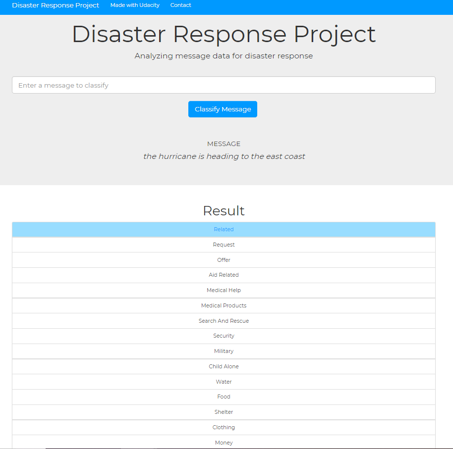

# Disaster Response Pipeline Project

This project creates a webapp allowing a user to input a message and classify it based on certain categories. The data that was used to train this model consists of messages sent during a disaster, so the model predicts whether certain messages fall into specific categories related to a disaster.

## Table of Contents
* [Installation](#installation)
* [Project Motivation](#motivation)
* [Instructions](#instructions)
* [Licensing, Authors, Acknowledgements](#licensing)

## Installation
The code requires Python versions of 3.* and general libraries available through the Anaconda package. In addition, the nltk package needs to be installed for the program to run successfully. For more details on the required packages, please refer to the files train_classifier.py and process_data.py.

## Project Motivation 
While a natural or other disaster is happening, millions of messages will be sent via social media and it is very difficult for disaster relief workers to determine which messages are relevant and where help needs to be sent. This webapp creates an easy-to-use interface that runs on a machine learning model which categorizes new messages into different categories and helps workers determine whether and what help is needed.

## Instructions 

1. Run the following commands in the project's root directory to set up your database and model.

	To run ETL pipeline that cleans data and stores in database `python data/process_data.py data/disaster_messages.csv data/disaster_categories.csv data/DisasterResponse.db`
	To run ML pipeline that trains classifier and saves `python models/train_classifier.py data/DisasterResponse.db models/classifier.pkl`

2. Run the following command in the app's directory to run your web app: `python run.py`

3. Go to http://0.0.0.0:3001/

## Licensing, Authors, Acknowledgements 
The data used for the analysis comes from Figure Eight and has been supplied by [Udacity](https://eu.udacity.com/legal/terms-of-use). Feel free to use the code as you please and use it for other dataset containing messages.
